# Keycloak OIDC with Quarkus and Apache HTTP Server

This project demonstrates a containerized application using:
- **Quarkus** application that displays user ID from HTTP headers
- **Keycloak** server for OIDC authentication with support for both local users and **Entra ID** (Microsoft Azure AD) federation
- **Apache HTTP Server** with `mod_auth_openidc` as a reverse proxy
- **Podman** for containerization

## Architecture

```mermaid
graph TB
    User[👤 User/Client]
    Apache[🌐 Apache HTTP Server<br/>mod_auth_openidc<br/>Port: 8443 HTTPS]
    Keycloak[🔐 Keycloak<br/>OIDC Provider<br/>Port: 443 HTTPS]
    Quarkus[☕ Quarkus App<br/>Port: 8081 HTTP]
    PostgreSQL[(🗄️ PostgreSQL<br/>Database)]
    EntraID[☁️ Entra ID<br/>Microsoft Azure AD<br/>Optional]

    User -->|1. HTTPS Request| Apache
    Apache -->|2. OIDC Auth Request| Keycloak
    Keycloak -->|3. Optional Federation| EntraID
    EntraID -.->|4. Auth Response| Keycloak
    Keycloak -->|5. OIDC Tokens| Apache
    Apache -->|6. Proxied Request<br/>X-User-Id Header| Quarkus
    Keycloak <-->|7. Data Storage| PostgreSQL
    
    style User fill:#e1f5ff
    style Apache fill:#fff4e1
    style Keycloak fill:#ffe1f5
    style Quarkus fill:#e1ffe1
    style PostgreSQL fill:#f0e1ff
    style EntraID fill:#e1f5ff,stroke-dasharray: 5 5
```



1. **Apache HTTP Server** acts as a reverse proxy with OIDC authentication (HTTPS on port 8443)
2. **Keycloak** provides OIDC authentication services (HTTPS on port 443)
3. **Quarkus** application receives authenticated requests with user ID in headers (HTTP on port 8081)
4. **PostgreSQL** database for Keycloak

All services communicate over an internal Docker network, with Apache and Keycloak exposing HTTPS endpoints externally.

## Prerequisites

- Podman installed
- Podman Compose installed
- Maven 3.8+ (for building Quarkus app)

## Setup Instructions

### 1. Build the Quarkus Application

```bash
cd quarkus-app
mvn clean package
cd ..
```

### 2. Generate SSL Certificates

Generate self-signed certificates for HTTPS:

```bash
# Generate certificates for Apache
./apache/generate-certs.sh

# Generate certificates for Keycloak
./keycloak/generate-certs.sh
```

### 3. Configure Keycloak Client Secret

Edit `apache/httpd-oidc.conf` and `keycloak/realm-config.json` to set a secure client secret:
- Replace `your-client-secret-here` with your actual secret in both files

**Note**: If you're using the externalized configuration (see section 4), you'll need to generate `realm-config.json` from the template after setting up Entra ID.

### 4. (Optional) Configure Entra ID Identity Provider

This project supports authentication via both Keycloak local users and Entra ID (Microsoft Azure AD). To enable Entra ID authentication:

#### 4.1. Register an Application in Entra ID

1. Go to the [Azure Portal](https://portal.azure.com)
2. Navigate to **Microsoft Entra ID** > **App registrations**
3. Click **New registration**
4. Enter a name for your application (e.g., "Keycloak Broker")
5. For **Supported account types**, select:
   - **Accounts in any organizational directory and personal Microsoft accounts** (if using `tenant: "common"`)
   - **Single tenant** (if using a specific tenant ID)
6. Set **Redirect URI**:
   - Type: **Web**
   - URI: `https://localhost/realms/demo/broker/entra-id/endpoint`
   - Note: Replace `localhost` with your actual Keycloak hostname in production
7. Click **Register**

#### 4.2. Configure Application Permissions

1. In your app registration, go to **API permissions**
2. Ensure the following Microsoft Graph permissions are added:
   - `openid` (OpenID Connect sign-in)
   - `profile` (View users' basic profile)
   - `email` (View users' email address)
3. Click **Grant admin consent** if required

#### 4.3. Create a Client Secret

1. In your app registration, go to **Certificates & secrets**
2. Click **New client secret**
3. Enter a description and select an expiration period
4. Click **Add**
5. **Copy the secret value immediately** (you won't be able to see it again)

#### 4.4. Configure Keycloak with Entra ID Credentials

The Entra ID configuration is externalized to prevent sensitive values from being committed to git:

1. **Create your configuration file**:
   ```bash
   cd keycloak
   cp keycloak-idp-config.env.example keycloak-idp-config.env
   ```

2. **Edit `keycloak-idp-config.env`** and fill in your Entra ID values:
   ```bash
   ENTRA_ID_ENABLED=true
   ENTRA_ID_TENANT_ID=your-tenant-id-here
   ENTRA_ID_CLIENT_ID=your-client-id-here
   ENTRA_ID_CLIENT_SECRET=your-client-secret-here
   ```

3. **Generate the realm configuration**:
   
   Using the shell script:
   ```bash
   ./generate-realm-config.sh
   ```
   
   This will generate `realm-config.json` from the template using your configuration values.

**Note**: The `keycloak-idp-config.env` file is gitignored and will not be committed. The generated `realm-config.json` is also gitignored to prevent accidental commits of sensitive data.

If you don't configure Entra ID, the project will work with Keycloak local users only.

### 5. Start the Services

```bash
podman compose up -d
```

Or using the podman-compose binary:
```bash
podman-compose up -d
```

### 6. Access the Application

- **Application**: https://localhost:8443/user
- **Keycloak Admin Console**: https://localhost/
  - Username: `admin`
  - Password: `admin`

## Default Test User

- Username: `testuser`
- Password: `testpassword`

## How It Works

### Authentication Flow

1. User accesses https://localhost:8443/user
2. Apache HTTP Server with `mod_auth_openidc` intercepts the request
3. If not authenticated, user is redirected to Keycloak login page
4. **User authentication options**:
   - **Keycloak local users**: User enters username/password (e.g., `testuser`/`testpassword`)
   - **Entra ID users**: User clicks on the "Entra ID" button (if configured), which redirects to Microsoft Entra ID for authentication
5. After authentication, Keycloak redirects back to Apache
6. Apache exchanges the authorization code for tokens and validates them
7. Apache extracts the user ID from OIDC claims and sets the `X-User-Id` header
8. Request is proxied to the Quarkus application
9. Quarkus application reads the `X-User-Id` header and returns it as JSON

### Entra ID Federation Flow (if configured)

When a user selects Entra ID authentication:
1. Keycloak redirects the user to Entra ID for authentication
2. User authenticates with their Microsoft/Entra ID credentials
3. Entra ID redirects back to Keycloak with an authorization code
4. Keycloak exchanges the code for tokens and creates/updates the user in Keycloak
5. Keycloak then redirects back to Apache with Keycloak's own tokens
6. The flow continues as described above

**Note**: On first login with Entra ID, Keycloak will import the user from Entra ID and may prompt for profile updates depending on the `updateProfileFirstLoginMode` setting.

For a detailed explanation of the OIDC authentication flow, see [OIDC_FLOW.md](OIDC_FLOW.md).

For a detailed explanation of application of a common theme to the Quarkus application and Keycloak pages, see [THEMING.md](THEMING.md).

## Configuration

### Apache OIDC Configuration

The Apache configuration in `apache/httpd-oidc.conf`:
- Connects to Keycloak OIDC provider
- Protects `/user` endpoint
- Extracts `preferred_username` claim and sets it as `X-User-Id` header
- Proxies requests to Quarkus application

### Keycloak Realm

The Keycloak realm configuration in `keycloak/realm-config.json`:
- Creates a `demo` realm
- Sets up a test user (for local authentication)
- Configures the `quarkus-app` client
- Optionally configures Entra ID as an identity provider (if externalized config is used)

**Configuration Management**:
- If using Entra ID, the realm configuration is generated from `keycloak/realm-config.json.template` using the `generate-realm-config.sh` script
- Sensitive Entra ID values (tenant ID, client ID, client secret) are stored in `keycloak/keycloak-idp-config.env` (gitignored)
- The template file `realm-config.json.template` contains placeholders that are replaced during generation
- Always run the generation script after updating your Entra ID configuration

**Identity Provider Configuration**:
- Entra ID identity provider is configured but not set as the default (`authenticateByDefault: false`)
- Users can select it from the Keycloak login page
- To automatically redirect to Entra ID, set `authenticateByDefault: true` in the identity provider configuration

## Authentication Methods

This project supports two authentication methods:

### 1. Keycloak Local Users

- Default test user: `testuser` / `testpassword`
- Users are managed directly in Keycloak
- No external dependencies required

### 2. Entra ID (Microsoft Azure AD) Federation

- Users authenticate with their Microsoft/Entra ID credentials
- Keycloak acts as a broker, federating authentication to Entra ID
- Users are automatically imported into Keycloak on first login
- Requires Entra ID app registration (see section 4)

Both authentication methods can be used simultaneously. Users will see both options on the Keycloak login page (if Entra ID is configured).

## Troubleshooting

### Check Service Logs

```bash
podman compose logs keycloak
podman compose logs apache
podman compose logs quarkus-app
```

### Verify Keycloak is Running

```bash
curl -k https://localhost/realms/demo/.well-known/openid-configuration
```

Note: The `-k` flag is used to skip SSL certificate verification (self-signed certificates).

### Rebuild Services

```bash
podman compose down
podman compose build --no-cache
podman compose up -d
```

### Entra ID Authentication Issues

If Entra ID authentication is not working:

1. **Verify Entra ID configuration**:
   - Check that `keycloak-idp-config.env` has correct values
   - Regenerate `realm-config.json` if you've updated the config: `cd keycloak && ./generate-realm-config.sh`
   - Restart Keycloak after regenerating the config

2. **Check redirect URI**:
   - Ensure the redirect URI in Entra ID app registration matches: `https://localhost/realms/demo/broker/entra-id/endpoint`
   - Replace `localhost` with your actual Keycloak hostname in production

3. **Verify Entra ID app permissions**:
   - Ensure `openid`, `profile`, and `email` permissions are granted
   - Check that admin consent has been granted if required

4. **Check Keycloak logs**:
   ```bash
   podman compose logs keycloak | grep -i "entra\|oidc\|identity"
   ```

5. **Verify identity provider is enabled**:
   - Access Keycloak Admin Console: https://localhost/
   - Navigate to Identity Providers → entra-id
   - Ensure it's enabled and visible on the login page

## Security Notes

- Change the default admin password for Keycloak in production
- Use secure client secrets
- Update `OIDCCryptoPassphrase` in Apache configuration
- **HTTPS is enabled by default** - the configuration uses self-signed certificates for development
- In production, replace self-signed certificates with certificates from a trusted CA
- Review and adjust OIDC session timeouts
- Consider enabling `OIDCSSLValidateServer` in production (currently disabled for self-signed certs)

## Stopping the Services

```bash
podman compose down
```

To remove volumes:
```bash
podman compose down -v
```

