# Apache Direct to Entra ID (Without Keycloak)

This branch demonstrates Apache HTTP Server connecting **directly** to Entra ID (Microsoft Azure AD) for OIDC authentication, **without** using Keycloak as an intermediary.

## Architecture

```mermaid
graph TB
    User[👤 User/Client]
    Apache[🌐 Apache HTTP Server<br/>mod_auth_openidc<br/>Port: 8443 HTTPS]
    EntraID[☁️ Entra ID<br/>Microsoft Azure AD<br/>OIDC Provider]
    Quarkus[☕ Quarkus App<br/>Port: 8081 HTTP]

    User -->|1. HTTPS Request| Apache
    Apache -->|2. OIDC Auth Request| EntraID
    EntraID -->|3. Auth Response<br/>Authorization Code| Apache
    Apache -->|4. Token Exchange| EntraID
    EntraID -->|5. ID Token & Access Token| Apache
    Apache -->|6. Proxied Request<br/>X-User-Id Header| Quarkus
    
    style User fill:#e1f5ff
    style Apache fill:#fff4e1
    style EntraID fill:#e1f5ff
    style Quarkus fill:#e1ffe1
```



1. **Apache HTTP Server** acts as a reverse proxy with OIDC authentication (HTTPS on port 8443)
2. **Apache** connects directly to **Entra ID** for authentication
3. **Quarkus** application receives authenticated requests with user ID in headers (HTTP on port 8081)

**Note**: Keycloak and PostgreSQL are **not required** for this configuration.

## Prerequisites

- Podman installed
- Podman Compose installed
- Maven 3.8+ (for building Quarkus app)
- Entra ID (Microsoft Azure AD) tenant with app registration

## Setup Instructions

### 1. Build the Quarkus Application

```bash
cd quarkus-app
mvn clean package
cd ..
```

### 2. Generate SSL Certificates

Generate self-signed certificates for HTTPS:

```bash
# Generate certificates for Apache
./apache/generate-certs.sh
```

### 3. Register an Application in Entra ID

1. Go to the [Azure Portal](https://portal.azure.com)
2. Navigate to **Microsoft Entra ID** > **App registrations**
3. Click **New registration**
4. Enter a name for your application (e.g., "Apache Direct OIDC")
5. For **Supported account types**, select:
   - **Accounts in any organizational directory and personal Microsoft accounts** (if using `tenant: "common"`)
   - **Single tenant** (if using a specific tenant ID)
6. Set **Redirect URI**:
   - Type: **Web**
   - URI: `https://localhost:8443/redirect_uri`
   - **Important**: Replace `localhost` with your actual Apache hostname in production
7. Click **Register**

### 4. Configure Application Permissions

1. In your app registration, go to **API permissions**
2. Ensure the following Microsoft Graph permissions are added:
   - `openid` (OpenID Connect sign-in)
   - `profile` (View users' basic profile)
   - `email` (View users' email address)
3. Click **Grant admin consent** if required

### 5. Create a Client Secret

1. In your app registration, go to **Certificates & secrets**
2. Click **New client secret**
3. Enter a description and select an expiration period
4. Click **Add**
5. **Copy the secret value immediately** (you won't be able to see it again)

### 6. Configure Apache with Entra ID Credentials

The Entra ID configuration is externalized to prevent sensitive values from being committed to git:

1. **Create your configuration file**:
   ```bash
   cd apache
   cp apache-entra-id-config.env.example apache-entra-id-config.env
   ```

2. **Edit `apache-entra-id-config.env`** and fill in your Entra ID values:
   ```bash
   ENTRA_ID_TENANT_ID=your-tenant-id-here
   ENTRA_ID_CLIENT_ID=your-client-id-here
   ENTRA_ID_CLIENT_SECRET=your-client-secret-here
   # Optional: Set a custom crypto passphrase
   # OIDC_CRYPTO_PASSPHRASE=your-crypto-passphrase-here
   ```

3. **Generate the Apache configuration**:
   ```bash
   ./generate-apache-config.sh
   ```
   
   This will generate `httpd-oidc.conf` from the template using your configuration values.

**Note**: The `apache-entra-id-config.env` file is gitignored and will not be committed. The generated `httpd-oidc.conf` is also gitignored to prevent accidental commits of sensitive data.

### 7. Start the Services

```bash
podman compose up -d
```

Or using the podman-compose binary:
```bash
podman-compose up -d
```

### 8. Access the Application

- **Application**: https://localhost:8443/user
- Users will be redirected to Entra ID for authentication

## How It Works

### Authentication Flow

1. User accesses https://localhost:8443/user
2. Apache HTTP Server with `mod_auth_openidc` intercepts the request
3. If not authenticated, user is redirected to **Entra ID** for authentication
4. User authenticates with their Microsoft/Entra ID credentials
5. Entra ID redirects back to Apache with an authorization code
6. Apache exchanges the authorization code for tokens and validates them
7. Apache extracts the user ID from OIDC claims and sets the `X-User-Id` header
8. Request is proxied to the Quarkus application
9. Quarkus application reads the `X-User-Id` header and returns it as JSON

**Key Difference**: In this configuration, Apache talks directly to Entra ID, bypassing Keycloak entirely.

## Configuration

### Apache OIDC Configuration

The Apache configuration in `apache/httpd-oidc.conf` (generated from template):
- Connects directly to Entra ID OIDC provider
- Uses Entra ID endpoints:
  - Metadata: `https://login.microsoftonline.com/{tenant-id}/v2.0/.well-known/openid-configuration`
  - Authorization: `https://login.microsoftonline.com/{tenant-id}/oauth2/v2.0/authorize`
  - Token: `https://login.microsoftonline.com/{tenant-id}/oauth2/v2.0/token`
  - UserInfo: `https://graph.microsoft.com/oidc/userinfo`
  - JWKS: `https://login.microsoftonline.com/{tenant-id}/discovery/v2.0/keys`
- Protects `/user` endpoint
- Extracts `preferred_username` claim and sets it as `X-User-Id` header
- Proxies requests to Quarkus application

## Troubleshooting

### Check Service Logs

```bash
podman compose logs apache
podman compose logs quarkus-app
```

### Entra ID Authentication Issues

If Entra ID authentication is not working:

1. **Verify Entra ID configuration**:
   - Check that `apache-entra-id-config.env` has correct values
   - Regenerate `httpd-oidc.conf` if you've updated the config: `cd apache && ./generate-apache-config.sh`
   - Restart Apache after regenerating the config

2. **Check redirect URI**:
   - Ensure the redirect URI in Entra ID app registration matches: `https://localhost:8443/redirect_uri`
   - Replace `localhost` with your actual Apache hostname in production

3. **Verify Entra ID app permissions**:
   - Ensure `openid`, `profile`, and `email` permissions are granted
   - Check that admin consent has been granted if required

4. **Check Apache logs**:
   ```bash
   podman compose logs apache | grep -i "oidc\|entra\|error"
   ```

5. **Verify OIDC configuration**:
   - Check that `httpd-oidc.conf` was generated correctly
   - Verify all Entra ID endpoints are accessible from the Apache container

### Rebuild Services

```bash
podman compose down
podman compose build --no-cache
podman compose up -d
```

## Security Notes

- Change the default `OIDCCryptoPassphrase` in production
- Use secure client secrets
- **HTTPS is enabled by default** - the configuration uses self-signed certificates for development
- In production, replace self-signed certificates with certificates from a trusted CA
- Review and adjust OIDC session timeouts
- Consider enabling `OIDCSSLValidateServer` in production (currently disabled for self-signed certs)

## Stopping the Services

```bash
podman compose down
```

## Comparison: Direct Entra ID vs Keycloak Broker

### Direct Entra ID (This Branch)
- **Simpler architecture**: Apache → Entra ID
- **No Keycloak dependency**: Fewer services to manage
- **Direct integration**: One less hop in authentication flow
- **Limited customization**: Entra ID login page only

### Keycloak Broker (Main Branch)
- **More flexible**: Can support multiple identity providers
- **User management**: Keycloak can manage users locally
- **Customization**: Can customize login pages and flows
- **More complex**: Requires Keycloak and PostgreSQL

Choose the direct Entra ID approach if you only need Entra ID authentication and want a simpler setup. Choose the Keycloak broker approach if you need multiple identity providers or advanced user management features.

